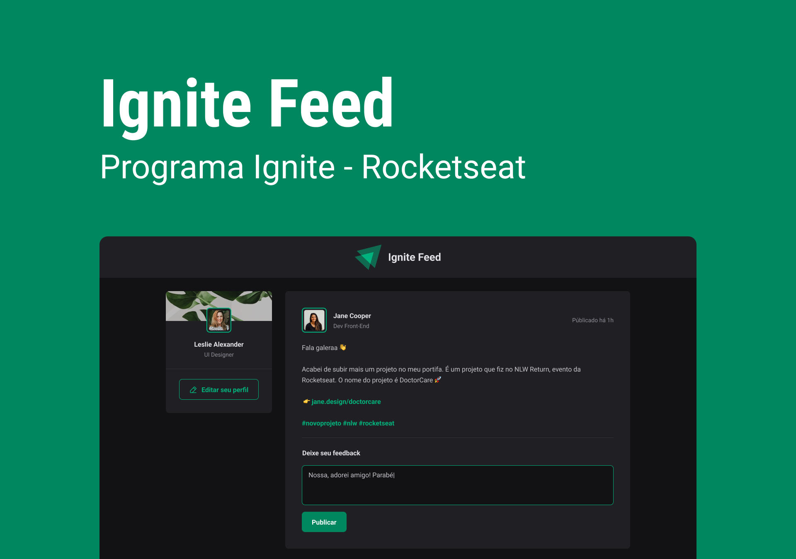

<h1 align="center"> Projeto 01 - Ignite Feed </h1>

  Ignite Feed é projeto simples realizado para o gerenciamento de posts.

  <a href="#-tecnologias">Tecnologias</a>&nbsp;&nbsp;&nbsp;|&nbsp;&nbsp;&nbsp;
  <a href="#-projeto">Projeto</a>&nbsp;&nbsp;&nbsp;|&nbsp;&nbsp;&nbsp;
  <a href="#memo-licença">Licença</a>

  

 

  

## 🚀 Tecnologias

Esse projeto foi desenvolvido com as seguintes tecnologias:

- HTML e CSS
- JavaScript
- Vite
- React
- Phosphor Icons

## 💻 Projeto

O projeto do Ignite Feed realizado foi para aprender os conceitos de estado, iteração no JSX, a propriedade key, componentes e propriedades.

## :memo: Licença

Esse projeto está sob a licença MIT.

---

Feito com ♥ by Natan Martins dos Santos :wave:
